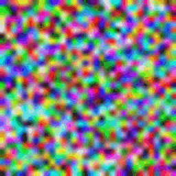
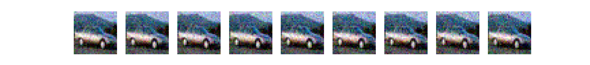

<div align="center">
  
</div>
<br>
    
# TinyDPPM

A small, from-scratch implementation of a **Denoising Diffusion Probabilistic Model (DDPM)** in PyTorch.

TinyDPPM isn't trying to be fast or state-of-the-art — it's built for learning and experimentation. Every core piece of a diffusion model is implemented by hand: the noise scheduler, the forward (noising) process, a small U-Net, the training loop, and the reverse (sampling) process.

## How it works



1. **`NoiseScheduler`** precomputes the beta/alpha/alpha-bar schedule used throughout training and sampling, in either `linear` or `cosine` mode.
2. **`ForwardDiffusion`** uses that schedule to noise a clean image to timestep `t` (`getNoisyTensor`), and to reverse a single denoising step given the model's predicted noise (`reverse`).
3. **`UNET`** is a small convolutional U-Net (3 encoder blocks, a bottleneck, 3 decoder blocks with skip connections) that predicts the noise added at a given timestep. The timestep is turned into a sinusoidal embedding, passed through an MLP, and injected into every block via a learned linear projection.
4. **`TrainProcess`** runs mini-batch gradient descent: sample a random `t` per image, noise the batch, predict the noise with the U-Net, and minimize MSE against the real noise. Loss is printed per batch, color-coded (green/red/yellow) depending on whether it improved.
5. **`VersionManager`** checkpoints the model to `versions/<name>-<epoch>.pth` after every epoch, and can reload the latest checkpoint on startup so training resumes where it left off. It also has a `save_on_fail` decorator that checkpoints the model if training crashes or is interrupted (e.g. `Ctrl+C`).
6. **`Datasets`** wraps `torchvision`'s `MNIST` and `CIFAR10` datasets behind a small, consistent interface (`train_loader` / `test_loader`), downloading them to `./data/` on first use.
7. **`Image` (`DiffusionImage`)** is a thin wrapper around a tensor/PIL image that handles the back-and-forth conversion used throughout the pipeline.

Training (`DPPM.py`) and sampling (`Generation.py`) are both built out of these same pieces.

## Project layout

| File | Purpose |
|---|---|
| `DPPM.py` | Entry point for training — wires everything together and starts the training loop |
| `Generation.py` | Entry point for sampling — runs the full reverse diffusion process and saves `output.png` |
| `NoiseScheduler.py` | Beta/alpha/alpha-bar schedule (linear or cosine) |
| `ForwardDiffusion.py` | Forward noising (`q`) and single-step reverse (`p`) diffusion math |
| `VariationalAutoEncoder.py` | Simple VAE, 16x16 latent space |
| `UNET.py` | The noise-prediction model, with timestep embeddings |
| `TrainProcess.py` | Training loop (mini-batch gradient descent, loss logging) |
| `VersionManager.py` | Checkpoint saving/loading, crash-safe autosave |
| `Datasets.py` | `MNIST` / `CIFAR` dataset + dataloader wrappers |
| `Image.py` | `DiffusionImage` tensor/PIL image helper |
| `util.py` | Small terminal color-printing helper for loss values |

## Requirements

- Python 3
- `torch`
- `torchvision`
- `matplotlib`
- `pillow`
- `numpy`

```bash
pip install torch torchvision matplotlib pillow numpy
```

## Usage

### Training

```bash
python DPPM.py
```

By default this trains on **CIFAR-10** (downloaded automatically to `./data/cifar10`) with a cosine noise schedule, 1000 timesteps, and 1000 epochs. The CIFAR-10 dataset is auto-downloaded on first run.

Checkpoints are written to `versions/tinydppm-<epoch>.pth` after every epoch. Re-running `DPPM.py` automatically picks up the latest checkpoint and continues training from that epoch.

If training is interrupted or throws an exception, the model is checkpointed before the error propagates, so no in-progress epoch is lost.

### Generating images

```bash
python Generation.py
```

This loads the latest checkpoint, starts from pure Gaussian noise (`1x3x32x32`, matching CIFAR-10 resolution), runs the full 1000-step reverse diffusion process, and writes the result to `output.png` in the working directory.

### Visualizing the forward (noising) process

Running `ForwardDiffusion.py` directly shows a sample CIFAR-10 image progressively noised over the first few timesteps, using `matplotlib`:

```bash
python ForwardDiffusion.py
```

## Notes

- This is a small, single-machine research/learning project — there's no distributed training, mixed precision, or EMA of weights.
- The U-Net is sized specifically for 32×32×3 CIFAR-style images; other resolutions would need architecture changes.
- `Datasets.py` can also be run standalone to pre-download a dataset: `python Datasets.py cifar` or `python Datasets.py mnist`.